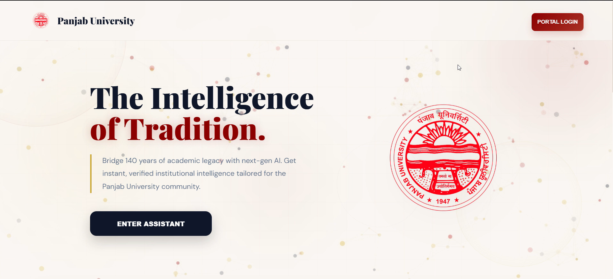
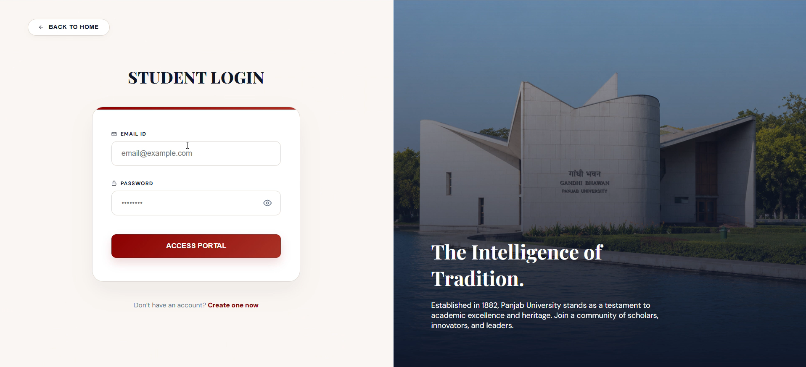
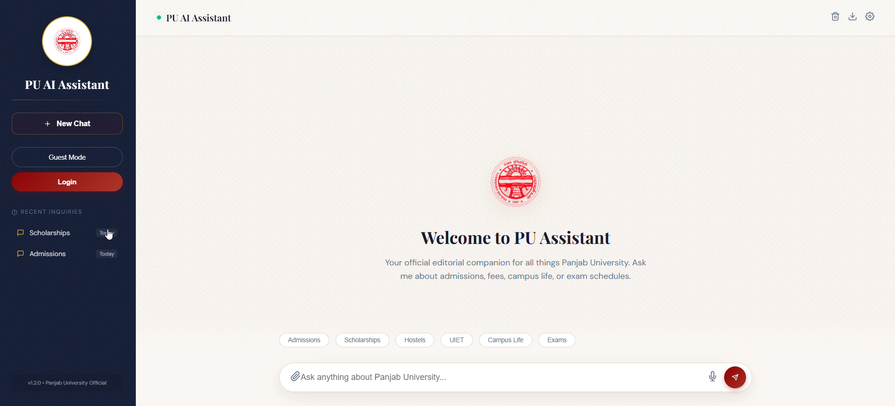

# AISOC Summer Internship – Team BotSquad

## 👥 Team Members

- **Nishika Rawat** – [nishikapnp2004@gmail.com]  
- **Nikhil Kaundal** – [nikhilkaundal1257@gmail.com]  
- **Rhythm Pandey** – [rhythmjk30@gmail.com]  
- **Manthan Dhiman** – [dhimaan0011@gmail.com]

## 📌 Assigned Problem Statement

**Title:** RAG-Based Chatbot for Panjab University  
**Description:**  
Develop a chatbot system using Retrieval-Augmented Generation (RAG) that leverages official Panjab University web content to provide instant, accurate answers to student queries. The chatbot should integrate advanced AI techniques and frameworks like LangChain or LlamaIndex for context-aware responses.

## 🚀 Quick Start Guide

### Prerequisites

- Python 3.8 or higher
- `pip` or `conda`
- Git
- Virtual environment (recommended)

### Setup Instructions

```bash
# Step 1: Clone the repository
git clone https://github.com/your-username/your-repo-name.git
cd your-repo-name

# Step 2: Create a virtual environment
python -m venv venv
source venv/bin/activate  # On Windows: venv\Scripts\activate

# Step 3: Install dependencies
pip install -r requirements.txt

# Step 4: Run the chatbot (example using Streamlit)
streamlit run app.py
```

## 📅 Timeline and Milestones  
| Week | Milestone                                                   |
|------|--------------------------------------------------------------|
| 1    | Project setup, repository structuring, scraping strategy planned |
| 2    | Website and PDF scraping completed, raw data stored         |
| 3    | Data cleaning, preprocessing, and chunking finalized        |
| 4    | Embedding with HuggingFace, indexing via LlamaIndex         |
| 5    | Chatbot development and Streamlit interface integration     |
| 6    | Final testing, documentation, demo upload, and presentation prep |

<h2>Screenshots</h2>






